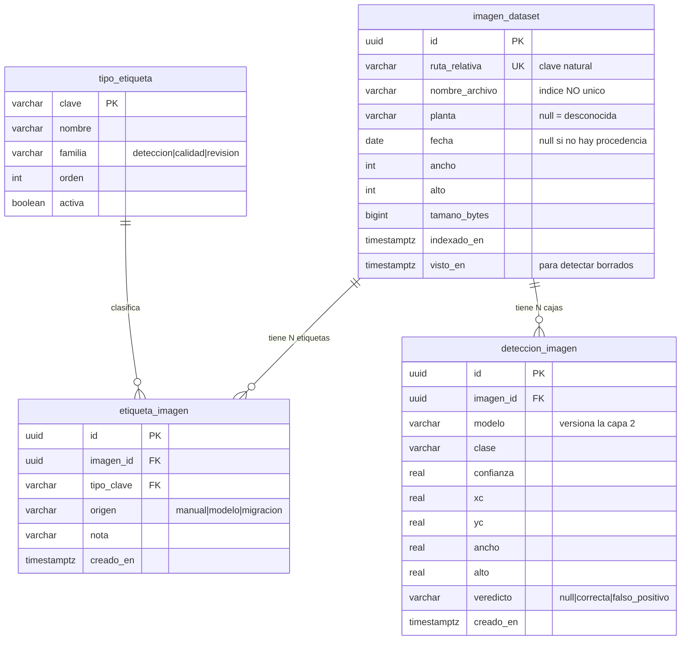

# Decisiones: inventario en Postgres + etiquetas N:M

> Documento de decisión, no de implementación. Registra **qué** se decidió y **por qué**,
> para que la justificación sobreviva al código. Fecha: 2026-09-21.

## El problema

El dataset pasó de 3.964 a ~48.357 imágenes (llegó `hospicio` con 44.393). El diseño actual
no aguanta ni esa escala ni el tipo de análisis que se quiere hacer.

Hoy la categorización se hace **copiando archivos a carpetas físicas** (`dataset/`,
`sin_vehiculo/`, `sin_deteccion/`) mientras las clasificaciones manuales viven en Postgres.
Ese híbrido tiene tres problemas concretos:

1. **Una imagen = un solo bucket.** Un archivo no puede estar en dos carpetas a la vez, pero
   las categorías reales son dimensiones ortogonales: una imagen puede tener brillo *y* ser un
   falso positivo *y* venir de hospicio.
2. **Recategorizar = mover bytes.** Correr un modelo mejor obligaría a mover miles de archivos.
3. **No escala.** `dataset.service.ts` hace `readdir` de la carpeta completa en cada request, y
   para `soloConCaja` lee **todos** los `.txt` de labels en cada llamada. Con 3.964 pasaba; con
   48.357 no.

## La idea central: tres capas, no una

La decisión de fondo es separar información que hoy está mezclada en la misma bolsa:

| Capa | Ejemplo | ¿Se puede regenerar? | Dónde va |
|---|---|---|---|
| **Procedencia** | hospicio, 2025-03-31 | **No** — se pierde al copiar la imagen | Estructura de carpetas + BD |
| **Detección** | caja (x,y), confianza 0.87, modelo `v1m` | **Sí** — se vuelve a correr el modelo | BD, versionada por modelo |
| **Juicio humano** | "tiene brillo", "descartada" | **No** — es tiempo tuyo, es lo más caro | BD |

La capa 2 es barata y desechable; las capas 1 y 3 son irreemplazables.

> **Regla que ordena todo: el disco guarda solo lo que no se puede regenerar.**
> La imagen original y su procedencia van al disco. Todo lo demás es interpretación y va a
> Postgres.

## Decisiones tomadas

### 1. "Brillo" es una propiedad de la imagen, no un diagnóstico del modelo

El sol directo sobre la patente, el reflejo de una ventana y el reflejo del ambiente son
**causas físicas distintas** de un **mismo efecto visible**: la patente queda lavada e
ilegible.

Se etiqueta el **efecto**, porque es una verdad permanente. Si se etiquetara "falló por
brillo", la etiqueta quedaría atada al modelo del momento: al correr un modelo mejor que sí
detecta esa imagen, la foto **sigue teniendo brillo** pero **ya no es un caso difícil**. El
fallo se **deriva** cruzando la etiqueta con las detecciones del modelo vigente — y eso además
permite medir "¿cuánto mejoró el modelo nuevo en imágenes con brillo?".

Corolario: efecto y causa se accionan distinto. El **efecto** le sirve al modelo (etiquetar,
medir, reentrenar). La **causa** le sirve a la instalación física (mover la cámara, poner un
parasol) — no se arregla con un modelo mejor.

### 2. "Falso positivo" se etiqueta sobre la caja, no sobre la imagen

Un falso positivo es el modelo detectando una forma que **especula** que es una patente. Si
dibujó 3 cajas y solo una está mal, la imagen entera no es un falso positivo — **esa caja** lo
es. Etiquetar la imagen completa perdería cuál de las tres falló, que es justamente lo que se
necesita para medir precisión y para reentrenar.

Por eso el veredicto humano (`correcta` / `falso_positivo`) vive en `deteccion_imagen`, por
caja, y no como etiqueta de imagen.

### 3. Catálogo de etiquetas en tabla, editable

Agregar "distancia" o un subtipo nuevo de falso positivo tiene que ser un `INSERT`, no una
migración más un deploy. El CHECK constraint de `1789600000000-ClasificacionDatasetPatentes.ts`
ya demostró esa fricción en la práctica.

### 4. Las 3.964 sueltas entran con planta desconocida explícita

No tienen procedencia recuperable: el nombre es un hash y no quedó carpeta de origen. Entran
con `planta = null`, así aparecen en el visualizador pero **no contaminan** ningún análisis
comparativo entre plantas.

### 5. Las carpetas de entrenamiento se generan, no se mantienen

Ultralytics exige carpetas físicas `images/train` + `labels/train` + `data.yaml`. Esa es la
única excepción legítima al modelo en BD — y se resuelve **materializándolas desde la base**
como un export efímero al momento de entrenar (con hardlinks, para no duplicar bytes), no
manteniéndolas como fuente de verdad.

## Modelo de datos nuevo

Solo las tablas nuevas. Las existentes (`imagen`, `preset`, `ejecucion`, `candidato_ejecucion`,
`entrenamiento_yolo`, `metrica_epoca`) no se tocan.

### Por qué cada decisión de esquema

- **`ruta_relativa` es la clave natural, `nombre_archivo` va con índice NO único.** Los 48.357
  nombres son globalmente únicos hoy (verificado: intersección 0 entre `hospicio` y `sueltas`),
  pero apostar a que el descargador de otra planta nunca repita un hash MD5 es gratis de
  evitar.
- **`etiqueta_imagen.origen`** (`manual` / `modelo` / `migracion`) distingue quién afirmó cada
  cosa. Permite borrar de un saque todo lo que puso un modelo y recalcularlo, sin tocar ni un
  juicio humano.
- **`deteccion_imagen.modelo`** versiona la capa 2: dos corridas de modelos distintos conviven
  sobre la misma imagen y se pueden comparar.
- **`ancho`/`alto` en el inventario** no son decorativos: sin ellos el frontend no puede alinear
  las cajas sobre la imagen (hoy están desalineadas porque la galería usa `objectFit: cover`,
  que recorta, mientras el overlay se posiciona en porcentajes).
- **`visto_en`** permite detectar imágenes que desaparecieron del disco **reportándolas**, sin
  borrar filas automáticamente.

### Catálogo inicial

| Familia | Claves |
|---|---|
| `deteccion` | `vehiculo_detectado`, `patente_detectada`, `sin_vehiculo_con_patente`, `sin_deteccion` |
| `calidad` | `brillo`, `suciedad`, `distancia` |
| `revision` | `descartada`, `revisada` |

Los subtipos de falso positivo **no** están acá: viven en `deteccion_imagen.veredicto`, por caja
(decisión 2).

## Qué se retira

- **`procedencia_imagen`** (todavía sin commitear a prod): se elimina. Sus dos columnas útiles
  ya viven en `imagen_dataset`, y el indexador deriva planta/fecha del path directamente, sin
  pasar por `batch_detect.py` → `procedencia.csv` deja de ser necesario.
- **`clasificacion_imagen_dataset`**: sobrevive read-only hasta migrar sus datos a etiquetas,
  después se dropea.
- **`D:\patentes Data Set` (2.0 GB)**: se borra. Verificado que **no contiene ningún byte de
  imagen único** — `sin_deteccion` (767) está 100% duplicado (293 en `dataset` + 474 en
  `sin_vehiculo`, cero huérfanos), y `dataset` (2.980) + `sin_vehiculo` (984) = 3.964 =
  exactamente lo que hay en `D:\img_dataset\sueltas\`.

  **Antes de borrar** hay que importar dos cosas que hoy existen solo ahí: los 3.965 labels
  `.txt` (4.2 MB) y la **pertenencia a carpeta**, que es información real que existe únicamente
  como estructura de directorios.

## Estado del disco (verificado 2026-09-21)

| Ruta | Contenido |
|---|---|
| `D:\img_dataset\hospicio\2025\<mes>\<día>\` | 44.393 JPG (mes/día sin cero adelante) |
| `D:\img_dataset\sueltas\` | 3.964 JPG históricas, sin procedencia |
| `D:\patentes Data Set\` | 2.0 GB, 100% duplicado salvo `labels/` |

Todas las imágenes son 640x480 `.JPG`. Disco D: 727 GB libres de 932 GB.

## Problemas detectados

Relevados durante el análisis del 2026-09-21. Se documentan tal cual se encontraron, tengan o
no relación directa con esta refactorización. Los que el rediseño resuelve de paso están
marcados; los demás son deuda independiente.

### Bloqueantes

| # | Problema | Dónde | Efecto |
|---|---|---|---|
| 1 | `.env` apunta `YOLO_IMAGENES_DIR` a `D:\imagenes - copia`, ruta que **ya no existe** (verificado con `Test-Path` → False; fue reemplazada por `D:\img_dataset`) | `.env:1` | Docker monta una carpeta vacía y `batch_detect.py` encuentra **0 imágenes**. El pipeline YOLO está roto ahora mismo |
| 2 | La **hora de captura no existe en ningún lado** y se sigue perdiendo en cada descarga | `download.js:166` | Ver "Decisiones abiertas #1". Es la variable más predictiva para la hipótesis del brillo |

### De escala (los resuelve el rediseño)

| # | Problema | Dónde | Efecto |
|---|---|---|---|
| 3 | `readdir` de la carpeta completa en **cada request**, sin cache ni TTL | `dataset.service.ts:245-248`, `:80-101` | Con 48.357 archivos, cada request recorre el directorio entero |
| 4 | `leerCajas` hace **N `readFile` por página** | `dataset.service.ts:255-275` | 24 lecturas de disco por scroll |
| 5 | `soloConCaja`/`soloSinCaja` leen los labels de **toda la carpeta**, no solo de la página | `dataset.service.ts:116-123` | Miles de `readFile` en una sola llamada HTTP |
| 6 | `obtenerResumen` hace 4 `readdir` + un `stat` **por cada label** (3.965 hoy) | `dataset.service.ts:48-77` | El endpoint de resumen es O(#labels) en syscalls |
| 7 | Sin `Cache-Control` en las imágenes servidas | `dataset.controller.ts:94-98` | El navegador re-pide los mismos bytes al scrollear |
| 8 | Paginación por offset con scroll infinito | `DatasetPage.tsx:191` | El offset se corre cada vez que se etiqueta algo: saltos y repetidos |

### Bugs funcionales

| # | Problema | Dónde | Efecto |
|---|---|---|---|
| 9 | **Las cajas no caen sobre la patente.** La galería usa `objectFit: cover` (que recorta) mientras el overlay se posiciona en porcentajes del contenedor | `GaleriaImagenes.tsx:35-42` vs `:43-58` | El rectángulo verde está visiblemente desalineado |
| 10 | `AccionQuitarClasificacion` al descartar **crea una segunda fila** sin borrar la anterior | `AccionQuitarClasificacion.tsx:29` | Una imagen queda a la vez como `patente_sin_vehiculo` y `descartada_sin_vehiculo` |
| 11 | El tag `"Dataset"` **nunca se invalida**; solo se invalida `"Clasificaciones"` | `datasetApi.ts:25-28` | El resumen queda desactualizado tras clasificar, hasta refrescar a mano |
| 12 | El mapa de casos difíciles se indexa **solo por `nombreArchivo`**, ignorando `origen` | `DatasetPage.tsx:116` | Colisión si el mismo nombre existe en dos carpetas |
| 13 | Invalidación grosera: un tag string sin `{type, id}` | `datasetApi.ts` | Cada mutación refetchea las 6 queries montadas de la página |

### Inconsistencias y deuda

| # | Problema | Dónde | Efecto |
|---|---|---|---|
| 14 | `NOMBRE_ARCHIVO_VALIDO` acepta **solo `.JPG` mayúsculas**, pero el listado acepta `.jpg` también | `dataset.service.ts:35` vs `:245-248` | Una imagen `.jpg` se lista pero devuelve 400 al pedir sus bytes |
| 15 | `RUTA_DATASET_YOLO` está en `.env.development` pero **falta en `.env.example`** | `apps/api/.env.example` | Una PC nueva no sabe que tiene que definirla |
| 16 | Dos variables distintas (`YOLO_DATASET_DIR` y `RUTA_DATASET_YOLO`) deben apuntar a la misma ruta, sincronizadas **a mano** | `.env:2`, `apps/api/.env.development:11` | Ya hay una advertencia sobre esto en `scripts/bootstrap-pc-nueva.ps1:101` |
| 17 | La ruta del disco está **hardcodeada** en el título de la UI | `DatasetPage.tsx:254` | Dice `D:\patentes Data Set` aunque se cambie la env |
| 18 | `listarClasificadas` devuelve filas de la BD **sin verificar que el archivo exista** en disco | `dataset.service.ts:154-175` | Una imagen borrada del disco sigue apareciendo en la galería, rota |
| 19 | `cargar-procedencia.ts` parsea el CSV con `split(",")` ingenuo | `cargar-procedencia.ts` | Se rompe si un nombre de planta llegara a tener una coma |
| 20 | `cargar-historico-yolo.ts` **no es idempotente** | `cargar-historico-yolo.ts` | Correrlo dos veces duplica las 3 corridas históricas |
| 21 | 299 MB duplicados en disco: `sin_deteccion` es copia byte a byte (`shutil.copy2`, no `move`) | `D:\patentes Data Set\sin_deteccion` | Lo resuelve el retiro de la carpeta |

### Reproducibilidad

| # | Problema | Dónde | Efecto |
|---|---|---|---|
| 22 | **Los scripts que crearon las carpetas físicas no están en este repo**: viven en un repo hermano standalone `GitHub\YOLO\` (`separate_no_detection.py`, `build_review_sheet.py`) | fuera de `ocr/` | El pipeline **no es reproducible** desde este repo |
| 23 | El split `dataset/` vs `sin_vehiculo/` se hizo con **robocopy manual**, no con un script | — | No hay registro versionado del criterio con que se partió el dataset |
| 24 | `auto_label.py` nombra los `.txt` por `stem` de imagen asumiendo nombres únicos entre carpetas | `services/yolo/auto_label.py:30` | Hoy funciona (los nombres son únicos), pero no está garantizado |
| 25 | Discrepancia de conteo en hospicio: 49.024 procesadas según `progress.json` vs 44.393 `.JPG` en disco | `D:\img_dataset\hospicio\` | Faltan ~4.631 sin explicación. Ver "Decisiones abiertas #3" |

## Decisiones abiertas

### 1. La hora de captura se está perdiendo (y todavía es recuperable)

Si la hipótesis es que el sol causa el brillo, **la hora es la variable más predictiva que
existe**. Hoy no está en ningún lado:

- Sin EXIF `DateTimeOriginal` (las imágenes traen solo 3 tags).
- El nombre es un hash MD5 que asigna el propio servidor de cámaras.
- El `mtime` local es la fecha de copia (2026-09-21), no de captura.
- La estructura de carpetas llega solo hasta el día.

Pero `download.js` guarda cada archivo **descartando el `Last-Modified`** que el servidor HTTP
casi seguro manda en la respuesta — y ese header es la hora de captura. Es el mismo error que
ya pasó con la procedencia, **salvo que este todavía se puede revertir**: el servidor
(`http://10.0.66.200/camara/2025/<mes>/<día>/JPG/`) sigue teniendo los archivos y se puede
consultar con `HEAD`, sin volver a bajar los 15 GB.

Propuesta: agregar `capturado_en timestamptz null` a `imagen_dataset`, arreglar el downloader
para que preserve el timestamp, y evaluar un script de recuperación. **Verificar primero** que
el servidor sea alcanzable y que efectivamente mande `Last-Modified` con la hora real.

### 2. Causa vs efecto del brillo

El modelo etiqueta el efecto (`brillo`). Si se quiere accionar sobre la instalación física hace
falta además la causa (`sol_directo`, `reflejo_ventana`). Se puede agregar después como
etiquetas de la familia `calidad` sin cambiar el esquema — esa es exactamente la ventaja del
catálogo editable (decisión 3).

### 3. Discrepancia de conteo en hospicio

`progress.json` dice 49.024 procesadas (31.174 bajadas + 17.850 saltadas) pero en disco hay
44.393 `.JPG`. Faltan ~4.631 y no está claro por qué. Conviene entenderlo antes de dar el
inventario por completo.
